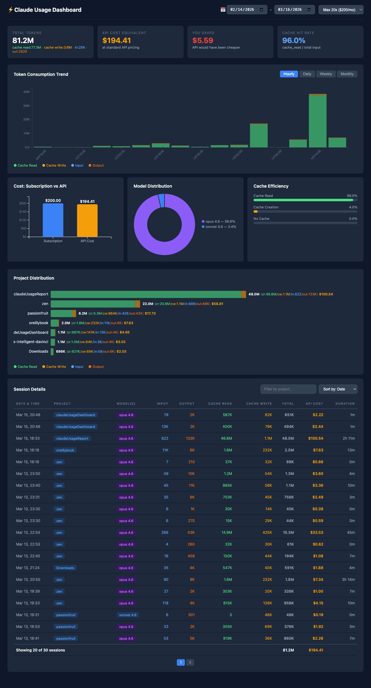

# Claude Usage Dashboard

A self-hosted dashboard that visualizes your [Claude Code](https://claude.ai/code) usage by parsing local JSONL session logs from `~/.claude/projects/`.



## Features

- **Token tracking** — Total tokens with breakdown by input, output, cache read, and cache write
- **Cost estimation** — API cost equivalent at standard pricing, compared against your subscription plan (Pro / Max 5x / Max 20x)
- **Token consumption trend** — Stacked bar chart with hourly, daily, weekly, or monthly granularity
- **Model distribution** — Donut chart showing usage across Claude models
- **Cache efficiency** — Visual breakdown of cache read, cache creation, and uncached requests
- **Project distribution** — Horizontal bar chart comparing token usage across projects
- **Session details** — Sortable, paginated table of every session with cost and duration

## Getting Started

```bash
# Clone and install
git clone https://github.com/ludengz/claudeUsageDashboard.git
cd claudeUsageDashboard
npm install

# Start the dashboard
npm start
```

Open http://localhost:3000 in your browser.

The dashboard reads logs from `~/.claude/projects/` — if you use Claude Code, these already exist on your machine. Logs are parsed once at startup; restart the server to pick up new session data.

## Tech Stack

- **Backend:** Node.js, Express 5
- **Frontend:** Vanilla JS (ES modules), D3.js v7
- **Tests:** Mocha + Chai

## Running Tests

```bash
npm test
```

## License

ISC
